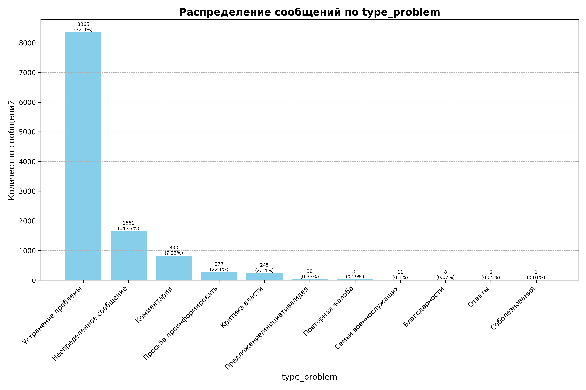

# Название

- [Название](#название)
  - [Абстракт](#абстракт)
  - [Введение](#введение)
  - [Обзор литературы](#обзор-литературы)
  - [Определение области и цели проекта](#определение-области-и-цели-проекта)
  - [Сбор и подготовка данных](#сбор-и-подготовка-данных)
  - [Выбор технологии и архитектуры модели](#выбор-технологии-и-архитектуры-модели)
    - [Описание модели и её модификации](#описание-модели-и-её-модификации)
    - [Метрики валидации](#метрики-валидации)
      - [BLEU (Bilingual Evaluation Understudy)](#bleu-bilingual-evaluation-understudy)
      - [ROUGE (Recall-Oriented Understudy for Gisting Evaluation)](#rouge-recall-oriented-understudy-for-gisting-evaluation)
      - [METEOR (Metric for Evaluation of Translation with Explicit ORdering)](#meteor-metric-for-evaluation-of-translation-with-explicit-ordering)
    - [Генерация текста](#генерация-текста)
      - [Argmax](#argmax)
      - [Temperature Sampling](#temperature-sampling)
      - [Top-k Sampling](#top-k-sampling)
      - [Top-p Sampling (Nucleus Sampling)](#top-p-sampling-nucleus-sampling)
  - [Обучение, оценка и оптимизация модели](#обучение-оценка-и-оптимизация-модели)
    - [Настройка параметров дообучения](#настройка-параметров-дообучения)
  - [Анализ результатов](#анализ-результатов)
  - [Возникшие проблемы](#возникшие-проблемы)
  - [Дальнеишее направление развития исследований](#дальнеишее-направление-развития-исследований)
  - [Источники](#источники)

## Абстракт

В рамках данной работы представлена задача разработки и обучения модели генерации текста, которая автоматизирует процесс создания ответов от представителей государственных органов на обращения граждан. Для решения этой задачи используется модель на основе архитектуры GPT-2 (Generative Pre-trained Transformer 2), которая дополнительно дообучается на специализированном наборе данных, включающем пары вопросов и ответов, собранных из реальной переписки между гражданами и представителями власти.

Ключевыми аспектами проекта являются подготовка и предобработка данных, обеспечивающие качественное обучение модели, включая кодирование типов сообщений и адаптацию модели для обработки конкретных запросов. Оценка качества генерируемых ответов осуществляется с помощью метрик BLEU, ROUGE и METEOR, которые позволяют количественно анализировать степень соответствия сгенерированных текстов эталонным ответам. Важной частью работы является также разработка и интеграция методов выбора следующего токена в процессе генерации текста, таких как argmax, top-k sampling и top-p (nucleus) sampling, каждый из которых предоставляет различные уровни разнообразия и предсказуемости текста.

<!-- Оценка эффективности предложенного подхода проводилась на основе сравнения результатов модели с эталонными ответами по критериям BLEU, ROUGE и METEOR. Было доказано, что модель эффективно адаптируется к задачам генерации текстов в контексте государственных услуг, показывая высокую степень соответствия с требованиями к качеству и релевантности ответов. Результаты тестирования подтвердили, что внедрение различных методов генерации текста значительно повышает качество и естественность сгенерированных ответов, обеспечивая при этом гибкость в управлении стилем и структурой ответов. Эти результаты подчеркивают потенциал применения передовых NLP-технологий для автоматизации и улучшения интерактивного взаимодействия между государством и гражданами. -->

## Введение

Развитие ИИ оказало заметное влияние на многие аспекты жизни человека, предоставив возможности для улучшения качества и доступности услуг, ускорения и оптимизации процессов принятия решений и внедрения автоматизированных систем в различные сферы деятельности. Одной из ключевых областей, демонстрирующих потенциал ИИ, является NLP, технология, позволяющая машинам понимать, интерпретировать и генерировать человеческий язык в его естественной форме.

Искусственный интеллект преобразует промышленность и социальные процессы, делая возможным автоматизацию задач, которые ранее требовали человеческого вмешательства. Это включает в себя такие области, как здравоохранение, где ИИ используется для диагностики заболеваний с высокой точностью, образование, где персонализированные учебные системы предлагают индивидуальные подходы к обучению, и транспорт, где автономные транспортные средства обещают сделать передвижение более безопасным и эффективным. Во всех этих случаях ИИ способствует повышению производительности, уменьшению ошибок и оптимизации ресурсов, что в конечном итоге ведет к более высокому качеству жизни и устойчивому развитию общества.

Обработка естественного языка (NLP) в последние годы достигла значительных успехов благодаря развитию глубоких нейронных сетей и массовому накоплению текстовых данных. Современные NLP-системы способны не только анализировать тексты с точки зрения грамматики и синтаксиса, но и извлекать смысловые и эмоциональные составляющие, что делает их приложения чрезвычайно широкими [1]. Примеры включают автоматическую генерацию текстов, машинный перевод, создание чат-ботов для обслуживания клиентов и многое другое. Такие технологии, как трансформеры и предобученные модели вроде GPT [2] и BERT [3], значительно продвинули понимание и генерацию естественного языка, демонстрируя впечатляющие результаты в таких задачах, как ответы на вопросы, автоматическое резюмирование и персонализированная коммуникация.

В направлении развития систем взаимодействия органов исполнительной власти и граждан, ИИ позволяет автоматизировать рутинные процедуры, ускоряя обработку запросов граждан, повышая точность административных решений и улучшая доступ к публичной информации [4]. Это способствует не только оптимизации работы государственных структур, но и усилению прозрачности и открытости власти.

Обработка естественного языка играет ключевую роль в автоматизации взаимодействий между гражданами и государственными службами. NLP-технологии позволяют разрабатывать системы, способные анализировать обращения граждан, автоматически генерировать ответы на стандартные вопросы и даже проводить первичный анализ сложных запросов, требующих вмешательства специалистов. Примеры применения включают:
- **Чат-боты и виртуальные помощники**: Автоматизация первичной поддержки граждан, предоставление ответов на часто задаваемые вопросы, помощь в заполнении форм и подаче заявлений.
- **Анализ обратной связи**: Использование NLP для анализа писем, жалоб и предложений граждан, что помогает выявлять общие тренды и проблемные области, требующие внимания.
- **Автоматизация документооборота**: Преобразование неструктурированного текста в структурированную форму, автоматическая категоризация документов, что снижает ручной труд и повышает эффективность процессов.

Интеграция ИИ и NLP в государственные структуры несет не только возможности, но и вызовы, особенно в области этики и защиты данных. Важно обеспечивать защиту личной информации, предотвращать предвзятость в алгоритмах и разрабатывать системы таким образом, чтобы они были понятны и прозрачны для граждан [8, 9].

## Обзор литературы

На текущий момент исследования в области генерации текстов для специфических задач продемонстрировали значительный прогресс благодаря развитию технологий машинного обучения, особенно глубокого обучения. Модели, основанные на архитектурах трансформеров, таких как GPT (Generative Pre-trained Transformer) [2] и BERT (Bidirectional Encoder Representations from Transformers) [3], выдвинулись на передний план в этой области. 

Исследования, направленные на генерацию текстов различной сложности и направленности, включают создание автоматических систем отчетности, генерацию новостей, автоматизацию написания кода, составление медицинских отчётов и многое другое. Такие системы требуют не только точного воспроизведения языковых структур, но и способности адаптироваться к специфическим требованиям домена.

Одной из выдающихся работ в этом направлении является статья Васвани и других  соавторов - "Attention is All You Need" [7], которая представила модель Трансформер (Transformer), лежащую в основе многих последующих исследований в области NLP. Эта архитектура позволила улучшить качество генерации текста за счёт лучшего улавливания контекста на длинных дистанциях.

Примером применения специфических генеративных моделей является исследование в области медицины, где ИИ используется для создания клинических записей и отчётов на основе данных пациентов. В работе Гуанксионга и соавторов [10] исследователи разработали модель, которая автоматически генерирует описания рентгеновских снимков грудной клетки, демонстрируя высокую клиническую точность.

В сфере программирования набирают популярность инструменты, такие как GitHub Copilot, основанные на модели GPT-3 от OpenAI [11], которые могут автоматически генерировать код по запросу пользователя, облегчая процесс разработки программного обеспечения.

Ещё одним важным направлением исследований является улучшение этических аспектов генерации текста. Работа Хендерсона, Шина и других [8] затрагивает вопросы предвзятости и транспарентности в автоматизированных системах генерации текста, подчеркивая необходимость разработки решений, способных обеспечить справедливое и беспристрастное использование ИИ в общественных и частных секторах.

Интеграция текстовых данных с дополнительными метаданными становится всё более популярной в современных исследованиях в области обработки естественного языка (NLP). Это позволяет моделям более эффективно понимать контекст и улучшать качество генерации или классификации текста. Примером такой работы является исследование Кескара [12], в которой которой рассматривается генерация текста с учётом контролируемых атрибутов, таких как настроение и стилистика, используя модель GPT-2 для создания текста с заданными характеристиками. Также стоит отметить ещё одну работу группы авторов [13], в которой рассматривается многоуровневый подход к обучению представлений, обучая модель одновременно на нескольких семантических задачах, что позволяет лучше улавливать семантические связи между различными типами данных. 

Исследование Ву и Хе [14]. показывает, как включение информации о категории сущностей в архитектуру BERT улучшает понимание контекста и точность модели в задачах классификации отношений. В ещё одной работе [15]   автор рассматривает совместное обучение распознавания именованных сущностей и связывания этих сущностей с их идентификаторами в базе данных, что также демонстрирует значительное улучшение процесса распознавания и связывания.

Различные научные работы и доклады подробно исследуют, как государственные органы могут использовать NLP для улучшения коммуникаций и автоматизации процессов, что позволяет повысить качество взаимодействия с гражданами и обработку больших объемов данных.

В работе Джао и других авторов [16] рассматриваются вопросы применения ИИ в управлении и интеграции в государственные органы, а также использование NLP для автоматизации ответов на запросы граждан и улучшения доступности информации.

В другой работе группы авторов во главе Гиовани [17] рассматривается важность цифровой трансформации в государственном управлении. Авторы делают акцент на использовании NLP для оптимизации обработки запросов и предоставления более качественных услуг.

Исследование Покхреда и других авторов [18] освещает потенциал ИИ и NLP в улучшении интерактивности между гражданами и государством. Основное внимание здесь уделено упрощению доступа к информации и госуслугам через улучшенные технологии обработки языка.

В России исследования в области обработки естественного языка (NLP) активно развиваются благодаря усилиям как академических, так и коммерческих организаций. Научные исследователи и разработчики применяют современные методы машинного обучения и глубокого обучения для решения широкого спектра задач, связанных с автоматизацией обработки текстов на русском языке [23]. 

Одним из заметных достижений является разработка русскоязычной версии бенчмарка SuperGLUE группой авторов [19]. Этот документ описывает адаптацию знаменитого англоязычного теста для оценки моделей NLP, что способствует улучшению качества и эффективности русскоязычных NLP-систем.

В Высшей Школе Экономики осуществляются проекты по анализу эмоциональной окраски текстов, что важно для мониторинга социальных медиа и анализа потребительских отзывов. Московский государственный университет фокусируется на создании и анализе больших текстовых корпусов, что помогает улучшить технологии обработки русского языка и его применение в различных областях. НИУ ВШЭ разрабатывает системы для автоматического извлечения и анализа информации из новостных потоков, способствующие выявлению общественных трендов и изменений в общественном мнении. Сбербанк активно внедряет чат-боты на основе NLP для улучшения взаимодействия с клиентами, что способствует повышению качества обслуживания и оптимизации процессов.

Эти и многие другие исследования показывают динамичное развитие области генерации текстов и важность интеграции технических, этических и практических аспектов для создания надежных и функциональных систем на базе искусственного интеллекта.

## Определение области и цели проекта

В рамках данной работы представлена задача разработки и обучения модели генерации текста, которая автоматизирует процесс создания ответов от представителей государственных органов на обращения граждан. Центральной целью проекта является разработка системы, способной анализировать текстовые сообщения, поступающие от пользователей, и генерировать адекватные, информативные ответы, соответствующие заданным критериям качества и релевантности.

Для достижения этой цели необходимо выполнить следующие задачи:
1. **Определить архитектуру и конткретную базовую модель трансформера**, выбрав наиболее подходящую из доступных предобученных моделей, таких как GPT-2 или BERT, в зависимости от их способности к адаптации под специфические требования задачи.
2. **Модифицировать архитектуру для учета заданных параметров**, включая интеграцию дополнительных данных, таких как категория обращения или предыдущие взаимодействия пользователя с государственными службами, для повышения точности и персонализации ответов.
3. **Формирование и описание набора данных**, который будет использоваться для обучения модели. Необходимо собрать, очистить и структурировать данные, состоящие из вопросов и ответов между гражданами и государственными учреждениями, учитывая различные аспекты, такие как тип сообщения, региональные особенности и предмет обращения. Данные должны быть размечены для обучения с учетом контекста и специфики задачи.
4. **Установить и определить метрики для оценки адекватности генерирования текста**, а также разработать методику их применения для оценки как точности, так и естественности текстов.
5. **Установить способы генерации текста**, определив и интегрировав различные стратегии для генерации более качественных и разнообразных текстовых ответов.
6. **Обучить модель**, проведя тренировку на собранных и обработанных данных с целью достижения оптимальной производительности и точности ответов.
7. **Сравнить полученные результаты** с эталонными ответами (предыдущими моделями) для оценки прогресса и эффективности новой системы, используя установленные метрики.

## Сбор и подготовка данных

Данный датасет собран из открытых источников, в частности, с официального аккаунта Администрации Губернатора и Правительства Московской области на платформе ВКонтакте [20]. Основу датасета составляют тексты сообщений пользователей, размещённые на постах и в комментариях к публикациям администрации, а также ответы от представителей государственных органов или соответствующих компетентных структур. Сбор данных осуществлялся с использованием специально разработанного краулера, который автоматизировал процесс экстракции текстовых данных.

Исходная информация (полученная краулером) имеет только: автора сообщения гражданина, текст сообщения, автора заинтересованной структуры, текст ответа. Другие параметры данных получают путём предварительной обработки данных, куда входит: определение тематики сообщения, тип сообщения, определение ответственной организации, категорию сообщения, определение региона. 

Все эти параметры помечаются (разметка данных) в автоматизированном  режиме, за исключением ответственного. Данные о принадлежности ответственных персон к определённым структурным подразделениям стало возможным благодаря предоставленной информации коллеги из администрации Московской области. Адрес назначается по контекстным данным, указанным в сообщении. Категория,  тип и тематика сообщения размечаются обученными языковыми моделями (BERT-подобными), точность моделей варьируется от 70 - 85%.

Датасет содержит информацию о взаимодействиях граждан с представителями госорганов, 8  параметров. Детальное описание структуры данных:

1. **responsible_person** - Персона или организация, ответственная за решение проблемы (например, "Администрация Химки").

2. **type_problem** - Тип проблемы, которую необходимо решить (например, "Устранение проблемы").

3. **topic** - Тема обращения, описывает конкретную проблему или вопрос (например, "Неудовлетворительное качество товара, оказания услуг").

4. **categoria** - Категория вопроса или проблемы (например, "Торговля, товары и услуги").

5. **region** - Регион, откуда поступило обращение (например, "Орехово-Зуевский").

6. **source** - Источник обращения или контекст, в котором возник вопрос. Содержит описание ситуации, которая привела к обращению (например, текст о цифровизации услуг).

7. **target** - Ответ уполномоченного лица госорганов на обращение гражданина. Содержит текстовый ответ на поставленный вопрос или проблему.

8. **context** - Дополнительный контекст обращения,содержит всю переписку участников диалога.

Датасет содержит только текстовую информацию (текст сообщений, метки, категории), включает 11475 записей, из которых 11140 содержат полную информацию без пропусков. Данные записаны в формате csv, размер файла 6452 КБ. К данным не применялась предварительная обработка данных (очистка). Данные разделены на тренировочный и валидационный наборы, последний составляет 10% от общего объёма данных, при этом данные были случайно перемешаны. В сообщениях присутствует дополнительная информация, такая как ссылки, смайлики и упоминания пользователей (id пользователей которых цитировали или упоминали), которая может создавать шум. Помимо  этого в данных присутствует дублирование сообщений пользователей, это связано с тем, что на одно сообщение необходим ответ нескольких ответственных лиц, имеющих различную юрисдикцию в решении проблема автора.  Эти факторы следует учитывать при обработке и анализе данных. Представленные данные использованы в обучении и валидации модели.

<table border="1" class="dataframe">
  <thead>
    <tr style="text-align: right;">
      <th></th>
      <th>responsible_person</th>
      <th>type_problem</th>
      <th>topic</th>
      <th>categoria</th>
      <th>region</th>
      <th>source</th>
      <th>target</th>
      <th>context</th>
    </tr>
  </thead>
  <tbody>
    <tr>
      <th>count</th>
      <td>11475</td>
      <td>11475</td>
      <td>11475</td>
      <td>11475</td>
      <td>11475</td>
      <td>11150</td>
      <td>11465</td>
      <td>11475</td>
    </tr>
    <tr>
      <th>unique</th>
      <td>181</td>
      <td>11</td>
      <td>120</td>
      <td>11</td>
      <td>56</td>
      <td>5534</td>
      <td>9821</td>
      <td>5694</td>
    </tr>
    <tr>
      <th>top</th>
      <td>Александр Αлексеев</td>
      <td>Устранение проблемы</td>
      <td>-</td>
      <td>ЖКХ</td>
      <td>Другие регионы</td>
      <td>Это ситуация в доме 15/2 - результат полного о...</td>
      <td>Здравствуйте! Спасибо за Ваш вопрос. В микрора...</td>
      <td>[id4847589|Александр], кто ответит за нанесён...</td>
    </tr>
    <tr>
      <th>freq</th>
      <td>717</td>
      <td>8365</td>
      <td>1663</td>
      <td>4848</td>
      <td>2513</td>
      <td>24</td>
      <td>111</td>
      <td>24</td>
    </tr>
  </tbody>
</table>

## Выбор технологии и архитектуры модели

### Описание модели и её модификации

В качестве базовой модели было принято решение использовать архитектуру GPT-2 [21], предварительно облученную модель ai-forever/rugpt3small_based_on_gpt2 [6], предназначенная для работы с русским языком. Этот выбор обусловлен высокой адаптируемостью модели к задачам генерации текста и её способностью обрабатывать большие объёмы информации для создания качественных текстовых ответов. Предварительное обучение на обширном текстовом корпусе обеспечивает модели прочную базу для дальнейшей настройки и дообучения под специфические задачи.

Разрабатываемая модель представляет собой модифицированную версию стандартной архитектуры GPT-2, адаптированную для специфических нужд взаимодействия с пользователями в контексте диалога с представителями власти. Основные модификации касаются интеграции дополнительных данных о типе сообщения, что позволяет модели более точно адаптироваться к контексту запросов и предоставлять релевантные ответы.

В качестве фреймворка проектирования модели используется PyTorch [22].

Модель включает слой nn.Embedding, что позволяет встраивать информацию о типе сообщения непосредственно в процесс обработки данных, это усиливает контекстуальное понимание модели. Дополнительный линейный слой nn.Linear интегрирует эмбеддинги типа сообщения с токенными эмбеддингами, обеспечивая корректный проход базовой модели. Выходной линейный слой преобразует последние скрытые состояния в логиты, необходимые для генерации последующих токенов.

В функции передачи данных `forward`, проектируемой модели, процесс начинается с генерации эмбеддингов для каждого токена и типа сообщения. Эти эмбеддинги затем комбинируются и усиливаются дополнительным линейным слоем (размер слоя равен размеру скрытого слоя базовой модели. 768), известным как. После этого, комбинированные эмбеддинги подаются в основную часть модели GPT-2. Модель обрабатывает входные данные, учитывая маску внимания, что позволяет модели сосредоточиться на релевантных частях входной последовательности. В завершающем этапе, последние скрытые состояния, полученные от GPT-2, преобразуются в логиты с помощью выходного линейного слоя (размер слоя равен размеру словаря). Эти логиты представляют собой вероятности следующих токенов, которые модель использует для генерации текста, обеспечивая по идее тем самым точность и релевантность генерируемых ответов.

В качестве оптимизатора модели для обучения был выбран оптимизатор AdamW [24], который является модификацией традиционного алгоритма Adam [25]. AdamW вносит улучшения в обработку штрафов за регуляризацию, что помогает лучше контролировать веса в сети и предотвращает их чрезмерный рост, обеспечивая более стабильное и эффективное обучение.

В качестве функции потерь была выбрана CrossEntropyLoss [26], которая широко используется для задач классификации с множественными классами. Эта функция потерь оценивает, насколько вероятности, предсказанные моделью для каждого класса, соответствуют фактическим меткам класса.

### Метрики валидации

Для оценки качества генерируемых текстов рассмотрим использование трёх широко распространённых метрики: BLEU [27], ROUGE [28] и METEOR [29]. Эти метрики позволяют количественно анализировать соответствие сгенерированных ответов эталонным ответам и оценивать их по различным аспектам качества, таким как точность, покрытие и упорядоченность.

#### BLEU (Bilingual Evaluation Understudy)
BLEU — это одна из наиболее популярных метрик для оценки качества машинного перевода, которая также широко применяется для задач генерации текста. BLEU измеряет, насколько n-граммы сгенерированного текста совпадают с n-граммами в эталонных текстах, учитывая их частоту вплоть до заданного размера n. BLEU оценивает точность, но с поправкой на «штраф за длину», чтобы избежать чрезмерно кратких ответов, которые искусственно могли бы увеличить совпадение n-грамм [27].

BLEU оценка рассчитывается следующим образом:

1. **Совпадение n-грамм**: Для каждой n-граммы в сгенерированном тексте проверяется, встречается ли она в эталонном тексте. Для каждой n-граммы вычисляется отношение числа совпадений к общему числу n-грамм в сгенерированном тексте.
   
   $$Precision_n = \frac{\sum_{\text{n-gram} \in \text{Candidate}} \min(\text{Count}(\text{n-gram}), \text{MaxRefCount}(\text{n-gram}))}{\sum_{\text{n-gram}\in \text{Candidate}} \text{Count}(\text{n-gram})}$$

   где `MaxRefCount(n-gram)` — максимальное количество данной n-граммы среди всех эталонных текстов, `Count(n-gram)` — количество данной n-граммы в кандидате.

2. **Геометрическое среднее**: Вычисляется геометрическое среднее из точностей n-грамм для различных n.

3. **Штраф за короткие тексты (Brevity Penalty, BP)**: Если сгенерированный текст короче эталонного, вводится штраф за короткую длину для предотвращения предпочтения необоснованно коротких ответов.

$$BP = 
\begin{cases} 
1 & \text{если } c > r \\ 
e^{(1-r/c)} & \text{если } c \leq r 
\end{cases}$$

   где `c` — длина сгенерированного текста, а `r` — длина эталонного текста или средняя длина нескольких эталонных текстов.

Итоговая оценка BLEU вычисляется как произведение геометрического среднего точности по всем n-граммам на штраф за короткие тексты (BP).

#### ROUGE (Recall-Oriented Understudy for Gisting Evaluation)
ROUGE используется для оценки автоматических рефератов или переводов и сосредоточена на полноте ответа, т.е., сколько n-грамм эталонного ответа захватывает сгенерированный ответ. ROUGE-L и ROUGE-N (где N указывает на размер n-грамм) — наиболее распространённые вариации [28].

Формула ROUGE-N:
$$ \text{ROUGE-N} = \frac{\sum_{s \in \text{Reference Summaries}} \sum_{n \in s} \text{Count}_{\text{match}}(n)}{\sum_{s \in \text{Reference Summaries}} \sum_{n \in s} \text{Count}(n)} $$

**ROUGE-L** фокусируется на длине наиболее длинной общей подпоследовательности, что позволяет оценить не только наличие ключевых слов и фраз, но и их последовательность в тексте, что важно для оценки качества и естественности текста.

#### METEOR (Metric for Evaluation of Translation with Explicit ORdering)
ETEOR — это метрика для оценки машинного перевода, которая была разработана как альтернатива BLEU для лучшего учета качества перевода с точки зрения человеческой оценки. Она учитывает не только точное совпадение слов, но и синонимы, стемминг и порядок слов, позволяя получить более гибкую и всестороннюю оценку. В отличие от BLEU, METEOR учитывает как точность, так и полноту, вводя понятия precision (P) и recall (R), и использует их для вычисления F-меры. Кроме того, METEOR вводит понятие "штраф за непоследовательность" (penalty), учитывающее различия в порядке слов между сгенерированным текстом и эталонным [29].

Основная формула METEOR включает в себя вычисление F-меры и штрафа за непоследовательность:

$$ \text{METEOR} = (1 - \text{penalty}) \cdot F_{\text{mean}} $$

где

$$ F_{\text{mean}} = \frac{10 \cdot P \cdot R}{R + 9 \cdot P} $$

- $P$ — точность (precision), доля совпадающих слов в переводе относительно общего числа слов в сгенерированном тексте.
- $R$ — полнота (recall), доля совпадающих слов в переводе относительно общего числа слов в эталонном тексте.
- $\text{penalty}$ — штраф за непоследовательность, вычисляемый на основе числа и длины совпадающих фрагментов слов в сгенерированном и эталонном текстах.

Существуют и другие метрики оценки, однако остановимся на наиболее распространённых методах.

### Генерация текста

В данной работе рассмотрены четыре основных метода генерации текста, которые широко используются в современных моделях генерации естественного языка. Каждый из этих методов имеет свои особенности и применяется для достижения различных аспектов разнообразия и точности в сгенерированных текстах [30].

#### Argmax
Этот метод выбирает следующий токен в последовательности, основываясь на максимальной вероятности из распределения логитов, предсказанных моделью. Это самый простой и детерминированный способ генерации текста.

Формула argmax:
$$ \text{next\_token} = \arg\max(logits) $$

#### Temperature Sampling
Temperature sampling модифицирует распределение вероятностей, делая его более "мягким" или "жестким", в зависимости от значения параметра температуры $T$. При $T > 1$ распределение становится более равномерным, что увеличивает разнообразие генерируемых ответов. При $T < 1$ распределение становится более "острым", уменьшая разнообразие и увеличивая детерминированность выбора.

Формула temperature sampling:
$$ P(i) = \frac{\exp(\log(p_i)/T)}{\sum_j \exp(\log(p_j)/T)} $$
где $ p_i $ — исходная вероятность токена $ i $.

#### Top-k Sampling
Top-k sampling ограничивает выборку следующего токена только $k$ наиболее вероятными токенами. Этот метод уменьшает риск выбора маловероятных токенов и позволяет сосредоточиться на более вероятных вариантах, что улучшает когерентность текста при сохранении элемента случайности.

Формула Top-k Sampling:
Выбирается подмножество токенов $C$ из всех возможных токенов $V$, где $|C| = k$ и каждый токен из $CS$ имеет максимальные вероятности из $V$. Затем выполняется:
$$ P(i) = \begin{cases} 
\frac{p_i}{\sum_{j \in C} p_j} & \text{if } i \in C \\
0 & \text{otherwise}
\end{cases} $$

#### Top-p Sampling (Nucleus Sampling)
Top-p sampling, также известный как nucleus sampling, выбирает минимальный набор токенов $C$, сумма вероятностей которых составляет $p$. Это позволяет исключить наименее вероятные токены и сосредоточить выборку на более вероятном "ядре" распределения.

Формула Top-p Sampling:
Выбираются токены так, что:
$$ \sum_{i \in C} p_i \geq p $$
и выполняется нормализация вероятностей для токенов в $C$:
$$ P(i) = \begin{cases} 
\frac{p_i}{\sum_{j \in C} p_j} & \text{if } i \in C \\
0 & \text{otherwise}
\end{cases} $$

## Обучение, оценка и оптимизация модели

### Настройка параметров дообучения

Дообучение модели настраивается с учётом следующих гиперпараметров:
- **Максимальная длина последовательности**: `max_length=32` обеспечивает баланс между детализацией ответов и вычислительной эффективностью;
- **Температура генерации**: `temperature=0.9` используется для контроля разнообразия генерируемого текста, что позволяет управлять степенью случайности в процессе выбора слов;
- **Размер батча**: `batch_size=16` обеспечивает  балансированную загрузку данных в модель во время обучения;
- **Размер тестового набора**: `test_size=0.1` позволяет выделить 10% данных для валидации модели;
- **Скорость обучения**: `learning_rate=1e-5`;
- **Количество эпох**: `num_epochs=3`.

## Анализ результатов

## Возникшие проблемы

## Дальнеишее направление развития исследований

## Источники

1. @article{article,
author = {Pais, Sebastião and Cordeiro, João and Jamil, M. Luqman},
year = {2022},
month = {04},
pages = {},
title = {NLP-based platform as a service: a brief review},
volume = {9},
journal = {Journal of Big Data},
doi = {10.1186/s40537-022-00603-5}
}
2. @article{radford2018improving,
  title={Improving Language Understanding by Generative Pre-training},
  author={Radford, Alec and Narasimhan, Karthik and Salimans, Tim and Sutskever, Ilya},
  journal={OpenAI Blog},
  year={2018},
  url={https://cdn.openai.com/research-covers/language-unsupervised/language_understanding_paper.pdf}
}
3. @misc{devlin2019bert,
      title={BERT: Pre-training of Deep Bidirectional Transformers for Language Understanding}, 
      author={Jacob Devlin and Ming-Wei Chang and Kenton Lee and Kristina Toutanova},
      year={2019},
      eprint={1810.04805},
      archivePrefix={arXiv},
      primaryClass={cs.CL}
}
4. @unknown{unknown,
author = {Ferreira, Carlos},
year = {2023},
month = {07},
pages = {},
title = {A short review of the main concerns in A.I. development and application within the public sector supported by NLP and TM}
}
5. @misc{openai2024gpt4,
      title={GPT-4 Technical Report}, 
      author={OpenAI and Josh Achiam and Steven Adler and Sandhini Agarwal and Lama Ahmad and Ilge Akkaya and Florencia Leoni Aleman and Diogo Almeida and Janko Altenschmidt and Sam Altman and Shyamal Anadkat and Red Avila and Igor Babuschkin and Suchir Balaji and Valerie Balcom and Paul Baltescu and Haiming Bao and Mohammad Bavarian and Jeff Belgum and Irwan Bello and Jake Berdine and Gabriel Bernadett-Shapiro and Christopher Berner and Lenny Bogdonoff and Oleg Boiko and Madelaine Boyd and Anna-Luisa Brakman and Greg Brockman and Tim Brooks and Miles Brundage and Kevin Button and Trevor Cai and Rosie Campbell and Andrew Cann and Brittany Carey and Chelsea Carlson and Rory Carmichael and Brooke Chan and Che Chang and Fotis Chantzis and Derek Chen and Sully Chen and Ruby Chen and Jason Chen and Mark Chen and Ben Chess and Chester Cho and Casey Chu and Hyung Won Chung and Dave Cummings and Jeremiah Currier and Yunxing Dai and Cory Decareaux and Thomas Degry and Noah Deutsch and Damien Deville and Arka Dhar and David Dohan and Steve Dowling and Sheila Dunning and Adrien Ecoffet and Atty Eleti and Tyna Eloundou and David Farhi and Liam Fedus and Niko Felix and Simón Posada Fishman and Juston Forte and Isabella Fulford and Leo Gao and Elie Georges and Christian Gibson and Vik Goel and Tarun Gogineni and Gabriel Goh and Rapha Gontijo-Lopes and Jonathan Gordon and Morgan Grafstein and Scott Gray and Ryan Greene and Joshua Gross and Shixiang Shane Gu and Yufei Guo and Chris Hallacy and Jesse Han and Jeff Harris and Yuchen He and Mike Heaton and Johannes Heidecke and Chris Hesse and Alan Hickey and Wade Hickey and Peter Hoeschele and Brandon Houghton and Kenny Hsu and Shengli Hu and Xin Hu and Joost Huizinga and Shantanu Jain and Shawn Jain and Joanne Jang and Angela Jiang and Roger Jiang and Haozhun Jin and Denny Jin and Shino Jomoto and Billie Jonn and Heewoo Jun and Tomer Kaftan and Łukasz Kaiser and Ali Kamali and Ingmar Kanitscheider and Nitish Shirish Keskar and Tabarak Khan and Logan Kilpatrick and Jong Wook Kim and Christina Kim and Yongjik Kim and Jan Hendrik Kirchner and Jamie Kiros and Matt Knight and Daniel Kokotajlo and Łukasz Kondraciuk and Andrew Kondrich and Aris Konstantinidis and Kyle Kosic and Gretchen Krueger and Vishal Kuo and Michael Lampe and Ikai Lan and Teddy Lee and Jan Leike and Jade Leung and Daniel Levy and Chak Ming Li and Rachel Lim and Molly Lin and Stephanie Lin and Mateusz Litwin and Theresa Lopez and Ryan Lowe and Patricia Lue and Anna Makanju and Kim Malfacini and Sam Manning and Todor Markov and Yaniv Markovski and Bianca Martin and Katie Mayer and Andrew Mayne and Bob McGrew and Scott Mayer McKinney and Christine McLeavey and Paul McMillan and Jake McNeil and David Medina and Aalok Mehta and Jacob Menick and Luke Metz and Andrey Mishchenko and Pamela Mishkin and Vinnie Monaco and Evan Morikawa and Daniel Mossing and Tong Mu and Mira Murati and Oleg Murk and David Mély and Ashvin Nair and Reiichiro Nakano and Rajeev Nayak and Arvind Neelakantan and Richard Ngo and Hyeonwoo Noh and Long Ouyang and Cullen O'Keefe and Jakub Pachocki and Alex Paino and Joe Palermo and Ashley Pantuliano and Giambattista Parascandolo and Joel Parish and Emy Parparita and Alex Passos and Mikhail Pavlov and Andrew Peng and Adam Perelman and Filipe de Avila Belbute Peres and Michael Petrov and Henrique Ponde de Oliveira Pinto and Michael and Pokorny and Michelle Pokrass and Vitchyr H. Pong and Tolly Powell and Alethea Power and Boris Power and Elizabeth Proehl and Raul Puri and Alec Radford and Jack Rae and Aditya Ramesh and Cameron Raymond and Francis Real and Kendra Rimbach and Carl Ross and Bob Rotsted and Henri Roussez and Nick Ryder and Mario Saltarelli and Ted Sanders and Shibani Santurkar and Girish Sastry and Heather Schmidt and David Schnurr and John Schulman and Daniel Selsam and Kyla Sheppard and Toki Sherbakov and Jessica Shieh and Sarah Shoker and Pranav Shyam and Szymon Sidor and Eric Sigler and Maddie Simens and Jordan Sitkin and Katarina Slama and Ian Sohl and Benjamin Sokolowsky and Yang Song and Natalie Staudacher and Felipe Petroski Such and Natalie Summers and Ilya Sutskever and Jie Tang and Nikolas Tezak and Madeleine B. Thompson and Phil Tillet and Amin Tootoonchian and Elizabeth Tseng and Preston Tuggle and Nick Turley and Jerry Tworek and Juan Felipe Cerón Uribe and Andrea Vallone and Arun Vijayvergiya and Chelsea Voss and Carroll Wainwright and Justin Jay Wang and Alvin Wang and Ben Wang and Jonathan Ward and Jason Wei and CJ Weinmann and Akila Welihinda and Peter Welinder and Jiayi Weng and Lilian Weng and Matt Wiethoff and Dave Willner and Clemens Winter and Samuel Wolrich and Hannah Wong and Lauren Workman and Sherwin Wu and Jeff Wu and Michael Wu and Kai Xiao and Tao Xu and Sarah Yoo and Kevin Yu and Qiming Yuan and Wojciech Zaremba and Rowan Zellers and Chong Zhang and Marvin Zhang and Shengjia Zhao and Tianhao Zheng and Juntang Zhuang and William Zhuk and Barret Zoph},
      year={2024},
      eprint={2303.08774},
      archivePrefix={arXiv},
      primaryClass={cs.CL}
}
6. @misc{zmitrovich2023family,
      title={A Family of Pretrained Transformer Language Models for Russian}, 
      author={Dmitry Zmitrovich and Alexander Abramov and Andrey Kalmykov and Maria Tikhonova and Ekaterina Taktasheva and Danil Astafurov and Mark Baushenko and Artem Snegirev and Tatiana Shavrina and Sergey Markov and Vladislav Mikhailov and Alena Fenogenova},
      year={2023},
      eprint={2309.10931},
      archivePrefix={arXiv},
      primaryClass={cs.CL}
}
7. @misc{vaswani2023attention,
      title={Attention Is All You Need}, 
      author={Ashish Vaswani and Noam Shazeer and Niki Parmar and Jakob Uszkoreit and Llion Jones and Aidan N. Gomez and Lukasz Kaiser and Illia Polosukhin},
      year={2023},
      eprint={1706.03762},
      archivePrefix={arXiv},
      primaryClass={cs.CL}
}
8. @misc{henderson2017ethical,
      title={Ethical Challenges in Data-Driven Dialogue Systems}, 
      author={Peter Henderson and Koustuv Sinha and Nicolas Angelard-Gontier and Nan Rosemary Ke and Genevieve Fried and Ryan Lowe and Joelle Pineau},
      year={2017},
      eprint={1711.09050},
      archivePrefix={arXiv},
      primaryClass={cs.CL}
}
9. @misc{corbettdavies2023measure,
      title={The Measure and Mismeasure of Fairness}, 
      author={Sam Corbett-Davies and Johann D. Gaebler and Hamed Nilforoshan and Ravi Shroff and Sharad Goel},
      year={2023},
      eprint={1808.00023},
      archivePrefix={arXiv},
      primaryClass={cs.CY}
}
10. @misc{liu2019clinically,
      title={Clinically Accurate Chest X-Ray Report Generation}, 
      author={Guanxiong Liu and Tzu-Ming Harry Hsu and Matthew McDermott and Willie Boag and Wei-Hung Weng and Peter Szolovits and Marzyeh Ghassemi},
      year={2019},
      eprint={1904.02633},
      archivePrefix={arXiv},
      primaryClass={cs.CV}
}
11. @misc{github2021copilot,
  title={Introducing GitHub Copilot: your AI pair programmer},
  author={GitHub},
  year={2021},
  howpublished={\url{https://github.blog/2021-06-29-introducing-github-copilot-ai-pair-programmer/}},
  note={Accessed: 2023-04-12}
}
12. @misc{keskar2019ctrl,
      title={CTRL: A Conditional Transformer Language Model for Controllable Generation}, 
      author={Nitish Shirish Keskar and Bryan McCann and Lav R. Varshney and Caiming Xiong and Richard Socher},
      year={2019},
      eprint={1909.05858},
      archivePrefix={arXiv},
      primaryClass={cs.CL}
}
13. @misc{sanh2018hierarchical,
      title={A Hierarchical Multi-task Approach for Learning Embeddings from Semantic Tasks}, 
      author={Victor Sanh and Thomas Wolf and Sebastian Ruder},
      year={2018},
      eprint={1811.06031},
      archivePrefix={arXiv},
      primaryClass={cs.CL}
}
14. @misc{wu2019enriching,
      title={Enriching Pre-trained Language Model with Entity Information for Relation Classification}, 
      author={Shanchan Wu and Yifan He},
      year={2019},
      eprint={1905.08284},
      archivePrefix={arXiv},
      primaryClass={cs.CL}
}
15. @misc{martins2019joint,
      title={Joint Learning of Named Entity Recognition and Entity Linking}, 
      author={Pedro Henrique Martins and Zita Marinho and André F. T. Martins},
      year={2019},
      eprint={1907.08243},
      archivePrefix={arXiv},
      primaryClass={cs.CL}
}
16. @inbook{inbook,
author = {Reis, João and Espírito Santo, Paula and Melao, Nuno},
year = {2019},
month = {04},
pages = {241-252},
title = {Artificial Intelligence in Government Services: A Systematic Literature Review},
isbn = {978-3-030-16180-4},
doi = {10.1007/978-3-030-16181-1_23}
}
17. @inproceedings{inproceedings,
author = {Liva, Giovanni and Codagnone, Cristiano and Misuraca, Gianluca and Gineikyte, Vaida and Barcevičius, Egidijus},
year = {2020},
month = {09},
pages = {502-509},
title = {Exploring digital government transformation: a literature review},
doi = {10.1145/3428502.3428578}
}
18. @INPROCEEDINGS{8845234,
author={Pokhrel, Shiva Raj and Sood, Keshav and Yu, Shui and Nosouhi, Mohammad Reza},
booktitle={IEEE INFOCOM 2019 - IEEE Conference on Computer Communications Workshops (INFOCOM WKSHPS)}, 
title={Policy-based Bigdata Security and QoS Framework for SDN/IoT: An Analytic Approach}, 
year={2019},
volume={},
number={},
pages={73-78},
keywords={Security;Quality of service;Wireless fidelity;Microsoft Windows;Computer architecture;Analytical models;Routing;Bigdata;SDN networks;IoT;Security},
doi={10.1109/INFCOMW.2019.8845234}
}
19. @misc{fenogenova2022russian,
      title={Russian SuperGLUE 1.1: Revising the Lessons not Learned by Russian NLP models}, 
      author={Alena Fenogenova and Maria Tikhonova and Vladislav Mikhailov and Tatiana Shavrina and Anton Emelyanov and Denis Shevelev and Alexandr Kukushkin and Valentin Malykh and Ekaterina Artemova},
      year={2022},
      eprint={2202.07791},
      archivePrefix={arXiv},
      primaryClass={cs.CL}
}
20. @misc{pressmo2023,
  author = {{Administration of the Governor and Government of Moscow Region}},
  title = {Official VKontakte Account of the Administration of the Governor and Government of Moscow Region},
  year = {2023},
  howpublished = {\url{https://vk.com/pressmo}},
  note = {Accessed: 2023-04-12}
}
21. @inproceedings{radford2019language,
  title={Language Models are Unsupervised Multitask Learners},
  author={Radford, Alec and Wu, Jeffrey and Child, Rewon and Luan, David and Amodei, Dario and Sutskever, Ilya},
  booktitle={OpenAI Blog},
  year={2019},
  url={https://cdn.openai.com/better-language-models/language_models_are_unsupervised_multitask_learners.pdf}
}

22. @misc{pytorch2019,
  title={PyTorch: An Imperative Style, High-Performance Deep Learning Library},
  author={Paszke, Adam and Gross, Sam and Massa, Francisco and Lerer, Adam and Bradbury, James and Chanan, Gregory and Killeen, Trevor and Lin, Zeming and Gimelshein, Natalia and Antiga, Luca and others},
  booktitle={Advances in Neural Information Processing Systems},
  volume={32},
  year={2019},
  publisher={Curran Associates, Inc.},
  howpublished = {\url{https://pytorch.org}},
  note = {Accessed: 2023-04-12}
}
23. @proceedings{ranlp-2021-deep,
    title = "Proceedings of the International Conference on Recent Advances in Natural Language Processing (RANLP 2021)",
    editor = "Mitkov, Ruslan  and
      Angelova, Galia",
    month = sep,
    year = "2021",
    address = "Held Online",
    publisher = "INCOMA Ltd.",
    url = "https://aclanthology.org/2021.ranlp-1.0",
}
24. @article{loshchilov2018decoupled,
  title={Decoupled Weight Decay Regularization},
  author={Loshchilov, Ilya and Hutter, Frank},
  journal={arXiv preprint arXiv:1711.05101},
  year={2018},
  url={https://arxiv.org/abs/1711.05101}
}
25. @article{kingma2014adam,
  title={Adam: A Method for Stochastic Optimization},
  author={Kingma, Diederik P and Ba, Jimmy},
  journal={arXiv preprint arXiv:1412.6980},
  year={2014},
  url={https://arxiv.org/abs/1412.6980}
}

26. @book{goodfellow2016deep,
  title={Deep Learning},
  author={Goodfellow, Ian and Bengio, Yoshua and Courville, Aaron},
  year={2016},
  publisher={MIT Press},
  url={http://www.deeplearningbook.org}
}

27. @inproceedings{papineni2002bleu,
  title={BLEU: a method for automatic evaluation of machine translation},
  author={Papineni, Kishore and Roukos, Salim and Ward, Todd and Zhu, Wei-Jing},
  booktitle={Proceedings of the 40th annual meeting of the Association for Computational Linguistics},
  pages={311--318},
  year={2002},
  organization={Association for Computational Linguistics}
}
28. @inproceedings{lin2004rouge,
  title={ROUGE: A Package for Automatic Evaluation of Summaries},
  author={Lin, Chin-Yew},
  booktitle={Text summarization branches out},
  pages={74--81},
  year={2004},
  organization={Association for Computational Linguistics}
}
29. @inproceedings{banerjee2005meteor,
  title={METEOR: An automatic metric for MT evaluation with improved correlation with human judgments},
  author={Banerjee, Satanjeev and Lavie, Alon},
  booktitle={Proceedings of the acl workshop on intrinsic and extrinsic evaluation measures for machine translation and/or summarization},
  pages={65--72},
  year={2005},
  organization={Association for Computational Linguistics}
}
30. @article{holtzman2019curious,
  title={The Curious Case of Neural Text Degeneration},
  author={Holtzman, Ari and Buys, Jan and Du, Li and Forbes, Maxwell and Choi, Yejin},
  journal={arXiv preprint arXiv:1904.09751},
  year={2019}
}

31. ff
32. f
33. f
34. f
35. f
36. f
37. f